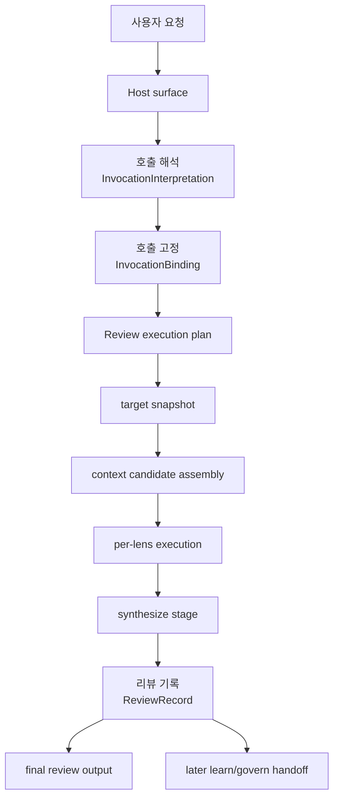

# Review Prototype-to-Product Mapping

> 상태: Active
> 목적: 현재 `onto` 프로토타입의 `검토 (review)` 흐름을 서비스형 구조로 다시 매핑하고, 어떤 부분을 `프롬프트 기반 기준 경로 (PromptBackedReferencePath)`로 먼저 살릴지, 어떤 부분을 이후 `구현 치환 단계 (ImplementationReplacementStep)`로 옮길지 고정한다.
> 기준 문서:
> - `dev-docs/prototype-runtime-llm-boundary-audit.md`
> - `dev-docs/development-methodology.md`
> - `authority/core-lexicon.yaml`
> - `dev-docs/review-lens-registry.md`
> - `dev-docs/review-record-contract.md`
> - `dev-docs/review-execution-preparation-artifacts.md`

---

## 1. Why `review` Comes First

현재 프로토타입에서 `검토 (review)`는 아래 이유로 가장 먼저 제품화해야 한다.

1. 사용자 가치가 가장 분명하다.
2. `LLM` 소유와 runtime 소유가 가장 뚜렷하게 섞여 있다.
3. 이후 `학습 (learn)`과 `운영 결정 (govern)`의 상위 입력이 된다.
4. 기존 `onto`의 핵심 경험을 가장 잘 보존해야 하는 영역이다.

즉 `review`는 “가장 먼저 버릴 프로토타입”이 아니라,
“가장 먼저 계약과 artifact를 세워야 하는 프로토타입”이다.

---

## 2. Current Prototype Flow

현재 `processes/review.md`의 상위 흐름은 아래다.

```text
0. 도메인 선택
1. Context Gathering
1.5 Complexity Assessment
2. Team Creation + Round 1
3. Synthesize + Adjudication
4. Deliberation (conditional)
5. Final Output
6. Wrap-Up (Learning Storage + Team Shutdown)
```

이 흐름은 실제로는 아래 세 층이 섞여 있다.

1. `LLM` 의미 판단
2. runtime/host orchestration
3. 프로토타입 고유의 Claude/Codex execution surface

서비스형 구조에서는 이 셋을 분리해야 한다.

---

## 3. Target Product Flow

`review`의 목표 서비스 흐름은 아래다.

Canonical live execution truth:

- `dev-docs/review-productized-live-path.md`



핵심 차이는 아래다.

- 현재 프로토타입은 `팀 생성`, `SendMessage`, `foreground/background agent spawn` 같은 host-specific step이 중심이다.
- 제품화에서는 이런 구현 이름보다 **맥락 격리 추론 단위 (ContextIsolatedReasoningUnit)** 라는 canonical 실행 성질이 더 중요하다.
- 목표 구조는 `호출 해석 (InvocationInterpretation)`, `호출 고정 (InvocationBinding)`, lens execution, `리뷰 기록 (ReviewRecord)` 중심이다.

즉 서비스형 구조에서 중심은 “팀 라이프사이클”이 아니라 “execution contract와 artifact”다.

---

## 4. Step-by-Step Mapping

| 현재 프로토타입 단계 | 현재 의미 | 목표 서비스 단계 | Owner | 비고 |
|---|---|---|---|---|
| 0. 도메인 선택 | review에 쓸 domain context 선택 | `호출 해석 (InvocationInterpretation)` + `호출 고정 (InvocationBinding)` + explicit user confirmation | 혼합 | 추천은 `LLM`, 도메인 목록 수집/선택값 고정은 runtime, 최종 선택은 사용자 확인 |
| 1. Context Gathering | 대상, 시스템 목적, domain docs, agent defs 수집 | `review execution plan` + `context candidate assembly` | 혼합 | 어떤 context가 필요한지 판단은 `LLM`, 실제 파일/문서 resolve는 runtime |
| 1.5 Complexity Assessment | 경량 리뷰 vs 전원 리뷰 판단 | `호출 해석 (InvocationInterpretation)`의 일부 | `LLM` | 관련 관점 수, 놓침 리스크, 교차 검증 필요성은 semantic judgment |
| 2. Team Creation + Round 1 | 에이전트 생성 및 독립 리뷰 | `per-lens execution` | 혼합 | 현재의 agent spawn은 later adapter/runtime detail로 내려가고, 핵심은 lens execution contract가 됨 |
| 3. Synthesize + Adjudication | 관점 종합, 목적 정합성 판단 | `synthesize` | `LLM` | synthesize는 계속 `LLM` 소유, 다만 output은 계약화된 artifact로 남겨야 함 |
| 4. Deliberation | contested point 재검토 | optional `re-ask / second-pass lens execution` | 혼합 | 서비스형 구조에서는 독립 step으로 남기되, host-specific direct messaging는 핵심 개념이 아님 |
| 5. Final Output | 사용자에게 결과 전달 | `final review output` | runtime + host | final output rendering은 runtime/host, 내용 초안은 synthesis artifact 기반 |
| 6. Learning Storage + Team Shutdown | 학습 저장, 팀 종료 | `ReviewRecord` 저장 + later `learn/govern` handoff + execution cleanup | 혼합 | review 단계에서는 우선 `리뷰 기록 (ReviewRecord)`까지만 확정하는 것이 우선 |

---

## 5. What the Product Must Preserve

서비스 전환 과정에서도 아래는 반드시 보존해야 한다.

### 5.1 Multi-perspective review

현재 `onto`의 핵심은 여러 관점으로 같은 대상을 본다는 점이다.

이것은 서비스형 구조에서도 그대로 유지해야 한다.

즉:

- `onto_logic`
- `onto_structure`
- `onto_dependency`
- `onto_semantics`
- `onto_pragmatics`
- `onto_evolution`
- `onto_coverage`
- `onto_conciseness`
- `onto_axiology`
- `onto_synthesize`

라는 구조는 유지하되,
`onto_axiology`는 독립 lens로,
`onto_synthesize`는 종합 단계로 분리해서 실행 방식만 host-specific team orchestration에서 lens/synthesis execution contract로 옮겨야 한다.

### 5.2 Purpose-oriented synthesis

`onto_synthesize`의 존재 이유는 단순 요약이 아니다.

- consensus 정리
- contradiction 재배치
- overlooked premise 발견
- system purpose에 비춘 재구성

그리고 그 목적 정합 판단의 독립 input은 `onto_axiology` lens가 제공한다.

이 구조는 제품화 이후에도 독립 단계로 살아 있어야 한다.

### 5.3 Human-usable output

현재 프로토타입의 최종 출력은 사람이 읽고 바로 적용/판단할 수 있는 review 결과다.
서비스형 구조에서도 `ReviewRecord`만 남기고 끝나면 부족하다.

즉:

- machine-readable artifact
- human-readable final review

두 층이 모두 필요하다.

---

## 6. What Must Change

### 6.1 Host-specific execution is not the canonical core

현재는 아래가 절차의 중심처럼 보인다.

- TeamCreate
- SendMessage
- Codex background task
- Claude team lifecycle

하지만 서비스형 구조에서 이건 canonical core가 아니다.

이것들은 나중에 아래 층으로 내려가야 한다.

- Claude adapter
- Codex adapter
- prompt-backed reference executor

즉 canonical core는 host-specific 팀 구조가 아니라:

- `호출 해석 (InvocationInterpretation)`
- `호출 고정 (InvocationBinding)`
- lens execution
- synthesis
- `리뷰 기록 (ReviewRecord)`

이다.

### 6.2 Learning storage is not review's primary output

현재 프로토타입은 Step 6에서 곧바로 learning storage로 이어진다.

서비스형 구조에서는 우선 순서를 아래처럼 바꿔야 한다.

1. review는 `리뷰 기록 (ReviewRecord)`를 남긴다
2. later `학습 (learn)`가 `ReviewRecord`를 읽어 candidate를 만든다
3. later `운영 결정 (govern)`이 승격 여부를 본다

즉 review의 primary output은 learning이 아니라 `리뷰 기록 (ReviewRecord)`다.

### 6.3 Domain selection must split

현재 Step 0은 하나의 절차처럼 보이지만 실제로는 분리되어야 한다.

1. 도메인 추천: `LLM`
2. 도메인 목록 수집 / explicit token parsing: runtime
3. 최종 도메인 선택: 사용자 확인

즉 Step 0은 later 아래 둘로 다시 써야 한다.

- `호출 해석 (InvocationInterpretation)`
- `호출 고정 (InvocationBinding)`

---

## 7. Prompt-Backed Reference Path for `review`

현재 `review` 제품화의 첫 실제 구현은 hardened runtime이 아니라
`프롬프트 기반 기준 경로 (PromptBackedReferencePath)`여야 한다.

그 reference path는 최소 아래를 따라야 한다.

### 7.1 Step A — Host request capture

- 사용자 자연어 요청을 받는다
- current repo/selected target 같은 explicit context를 함께 본다

### 7.2 Step B — `호출 해석 (InvocationInterpretation)`

`LLM`이 아래를 해석한다.

- entrypoint가 `review`인지
- target candidate가 무엇인지
- intent가 무엇인지
- domain recommendation이 필요한지
- lightweight/full review recommendation이 필요한지

### 7.3 Step C — `호출 고정 (InvocationBinding)`

runtime이 아래를 고정한다.

- 실제 target scope / bundle
- `도메인 최종 선택 (DomainFinalSelection)`
- resolved workspace root
- selected domain context
- review session root
- artifact path

### 7.4 Step D — Lens execution

각 관점 문서(`roles/*.md`)는 prompt contract의 source가 된다.

즉 현재 `roles/onto_logic.md` 같은 파일은 나중에 `lens prompt contract`로 승격될 source material이다.

프롬프트 기준 경로에서는 각 lens를 **맥락 격리 추론 단위**로 실행해
lens별 context를 분리해야 한다.

가능한 realization 예:

- Agent Teams teammate
- subagent
- `MCP`로 분리된 `LLM`
- 독립 background agent
- external model worker

즉 host-specific realization은 달라도,
`lens별 독립 맥락 분리`는 유지해야 한다.

추가로 이 단계는 메인 `LLM` 콘텍스트를 보존해야 한다.

즉:

- per-lens detailed reasoning은 `맥락 격리 추론 단위`가 소유하고
- 메인 콘텍스트는 orchestration, binding, 그리고 later synthesize에 집중한다

따라서 legacy source path의 `subagent` 활용은
우연한 구현이 아니라,
`제품화된 실시간 경로 (productized live path)`에서도 보존해야 할 핵심 실행 성질의 source material이다.

### 7.5 Step E — Synthesize stage

현재 `roles/onto_synthesize.md`는 synthesis prompt contract의 source material이 된다.
그리고 `roles/onto_axiology.md`는 목적/가치 정합 lens contract의 source material이 된다.

### 7.6 Step F — `리뷰 기록 (ReviewRecord)`

per-lens finding, synthesis, target snapshot, context refs, final draft output을
후속 `learn/govern`가 읽을 수 있는 형태로 고정한다.

---

## 8. Implementation Replacement Steps

`review` 제품화의 권장 치환 순서는 아래다.

### Step 1. `호출 해석 (InvocationInterpretation)` 추출

현재:

- command 문서
- `process.md` 도메인 선택 규칙
- `processes/review.md` 복잡도 판단

에 흩어진 해석 책임을 하나의 interpretation contract로 추출한다.

### Step 2. `호출 고정 (InvocationBinding)` 추출

현재:

- target scope validation
- token parsing
- domain final selection materialization
- config fallback
- directory creation
- session naming

을 deterministic binding contract로 추출한다.

### Step 3. Lens prompt contracts 추출

현재 `roles/*.md`를 later lens execution contract의 source로 사용한다.

현재 baseline:

- `dev-docs/review-lens-prompt-contract.md`

### Step 4. Synthesis prompt contract 추출

현재 `onto_synthesize.md`와 `processes/review.md` Step 3/4를 synthesis contract로 재구성한다.

현재 baseline:

- `dev-docs/review-synthesize-prompt-contract.md`

### Step 5. `리뷰 기록 (ReviewRecord)` artifact 정의

현재 최종 텍스트 output 위주인 구조를
later `learn/govern`가 읽을 수 있는 structured artifact 중심으로 바꾼다.

현재 baseline:

- `dev-docs/review-record-contract.md`
- `dev-docs/review-execution-preparation-artifacts.md`

---

## 9. Concepts to Borrow Immediately from `onto-llm-independent`

다음 개념은 현재 `onto`의 `review` 제품화에 바로 가져와야 한다.

1. `semantic ambiguity implies LLM ownership`
2. `closed-world validation implies runtime ownership`
3. `PromptBackedReferencePath`
4. `ImplementationReplacementStep`
5. `ReviewRecord`
6. 단계 상태판(flow status) 문서 운영 방식
7. `review target scope / bundle`
8. `domain final selection`
9. `lens selection plan`

반대로 아직 바로 가져오지 않아도 되는 것은 아래다.

1. execution profile 세분화 (`worker_fixture`, `worker_model_backed`)
2. unlock owner policy
3. provider provenance artifact의 상세 shape

이것들은 `review`의 기준 경로가 먼저 살아난 뒤 붙여도 된다.

---

## 10. Immediate Next Step

이 문서 다음에 바로 해야 할 일은 아래다.

1. 현재 `review`의 `호출 해석 (InvocationInterpretation)` source를 추출한다.
   - `commands/review.md`
   - `process.md` 도메인 선택 규칙
   - `processes/review.md` 복잡도 평가 규칙
2. 이를 `review`용 interpretation contract 초안으로 다시 쓴다.
3. 동시에 현재 runtime/host가 맡을 `호출 고정 (InvocationBinding)` 범위를 분리한다.

즉 현재 직접 대상으로 올라온 계약은 아래다.

- `review interpretation contract`
- `review binding contract`
- `review lens prompt contract`
- `review synthesize prompt contract`

현재 baseline 문서는 아래다.

- `dev-docs/review-interpretation-contract.md`
- `dev-docs/review-binding-contract.md`
